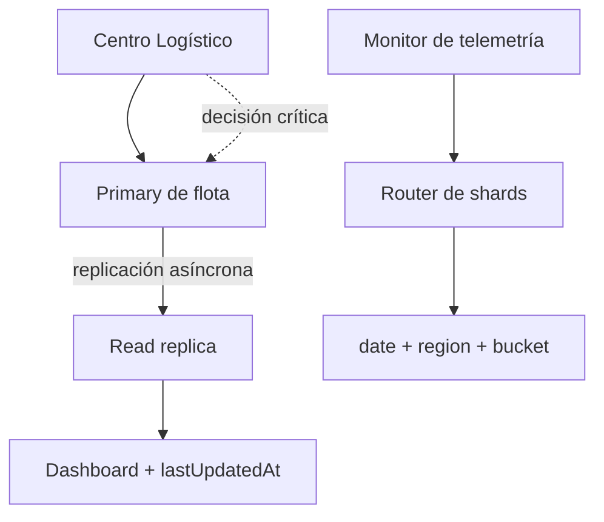

# Sesión 31 - Replicación y partición de datos

## Objetivo

La implementación demuestra:

- replicación asíncrona entre `primary` y réplica de lectura;
- una `stale read` observable durante el `replication lag`;
- asignación atómica con validación de `status` y `expectedVersion`;
- uso de `Idempotency-Key` para reintentos de la misma intención;
- separación entre lecturas informativas y decisiones críticas;
- partición de telemetría por `date + region + bucket(droneId)`;
- detección de una `hot partition` cuando CENTRO genera 70% de los eventos;
- comparación de carga antes y después de agregar buckets;
- plan de rebalanceo con riesgos y métricas;
- cambio de routing cuando `Drone-Gamma-9` cruza de ESTE a OESTE;
- métricas `replicaLagMs`, stale reads, hotspots y asignaciones duplicadas evitadas.

## Archivos implementados

```text
services/monitor-telemetria/src/data-distribution-lab.js
services/monitor-telemetria/test/data-distribution-lab.test.js
services/observability-platform/src/adapters/data-distribution-adapter.js
services/observability-platform/test/data-distribution-adapter.test.js
docs/instrucciones-laboratorio-sesion-31.md
```

También se integró la sesión en:

```text
services/monitor-telemetria/package.json
services/observability-platform/src/lab-registry.js
services/observability-platform/public/app.js
services/observability-platform/public/index.html
services/observability-platform/scripts/smoke.js
```

## Arquitectura aplicada



Regla principal:

```text
El dashboard puede leer una réplica.
Asignar un dron y actuar por batería crítica requiere primary u otra validación fuerte.
```

## Comandos

Desde `services/monitor-telemetria`:

```bash
npm run lab:data-distribution -- --stale-replica-assignment
npm run lab:data-distribution -- --telemetry-hot-partition
npm run lab:data-distribution -- --gamma-cross-zone
```

Salida JSON:

```bash
npm run lab:data-distribution -- --stale-replica-assignment --json
```

Línea de tiempo:

```bash
npm run lab:data-distribution -- --gamma-cross-zone --timeline
```

Pruebas específicas:

```bash
node --test test/data-distribution-lab.test.js
```

Pruebas completas:

```bash
npm test
```

## Modos implementados

| Modo | Problema | Decisión demostrada |
|---|---|---|
| `stale-replica-assignment` | La réplica todavía muestra `AVAILABLE v14` después de que el primary confirmó `IN_MISSION v15`. | La segunda misión se rechaza porque la decisión valida estado y versión en el primary. |
| `telemetry-hot-partition` | CENTRO concentra 70 de 100 eventos cuando la clave es solo `regionId`. | Se usa `date + region + bucket(droneId)` y se planea el rebalanceo. |
| `gamma-cross-zone` | `Drone-Gamma-9` cruza a OESTE mientras el dashboard está stale. | Se rechaza la asignación duplicada, se cambia el shard de telemetría y la batería crítica se valida con dato fuerte. |

## Actividad A - Clasificación de datos AURA

| Dato | Criticidad | Volumen | ¿Tolera atraso? | ¿Puede leer réplica? | Partición propuesta |
|---|---|---|---|---|---|
| `drones.status` | Alta | Medio | Muy poco | Solo información | `regionId + hash(droneId)` |
| `missions.active` | Alta | Medio | No | No para decidir | `missionId` o `regionId` |
| `orders` | Alta | Alto | Poco | Solo información | `regionId + hash(orderId)` |
| `telemetry.gps` | Media-alta | Muy alto | Limitado | Sí para histórico | `date + region + bucket(droneId)` |
| `batteryCritical` | Alta | Medio | Muy poco | No sin validación fuerte | `droneId` |
| `dashboard_view` | Media | Muchas lecturas | Segundos | Sí, mostrando frescura | `regionId` |
| `audit_events` | Alta | Alto | Sí, pero sin pérdida | Sí, consolidada | `date + type + bucket(eventId)` |

## Actividad B - Propuesta de partición

| Dato | Shard key | Justificación | Riesgo |
|---|---|---|---|
| `drones` | `regionId + hash(droneId)` | Mantiene consultas regionales y distribuye drones dentro de la zona. | El cambio de zona exige actualizar routing. |
| `missions` | `missionId` o `regionId` | Alinea el dato con la misión o la operación regional dominante. | Una misión entre zonas puede consultar varios shards. |
| `orders` | `regionId + hash(orderId)` | Distribuye escrituras y conserva la vista regional. | Los reportes globales consultan varios shards. |
| `telemetry` | `date + region + bucket(droneId)` | Escala escritura, facilita retención y reduce hotspots. | Routing y consultas globales más complejas. |
| `audit_events` | `date + type + bucket(eventId)` | Favorece append-only, retención y paralelismo. | La consolidación debe manejar llegada tardía y duplicados. |

No se usa `status` como shard key porque tiene pocos valores, cambia con frecuencia y concentraría carga.

## Actividad C - Propuesta de replicación

| Dato | Tipo de replicación | Lecturas desde réplica | Riesgo | Mitigación |
|---|---|---|---|---|
| Estado del dron | Primary + réplicas asíncronas | Dashboard y listados informativos | Estado stale | Validar estado y versión en primary para acciones críticas |
| Dashboard | Read model asíncrono | Todas | Vista temporalmente vieja | `lastUpdatedAt`, tolerancia y `replica_lag_ms` |
| Telemetría histórica | Copias regionales asíncronas | Análisis histórico | Muestras tardías | Idempotencia, watermark y lag |
| Auditoría | Append-only durable y asíncrono | Investigación consolidada | Pérdida o duplicado | Log durable, `eventId` y replay |
| Configuración operativa | Primary o copia validada fuertemente | Solo visualización no crítica | Política de seguridad vieja | Versión y lectura fuerte antes de aplicar |

## Escenario 1 - Réplica atrasada y asignación segura

Estado inicial:

```json
{
  "primary": {
    "droneId": "Drone-Alpha-1",
    "status": "AVAILABLE",
    "missionId": null,
    "version": 14
  },
  "replica": {
    "droneId": "Drone-Alpha-1",
    "status": "AVAILABLE",
    "missionId": null,
    "version": 14
  }
}
```

La primera asignación usa:

```text
missionId = M-991
expectedVersion = 14
Idempotency-Key = assign:O-991:Drone-Alpha-1
source = PRIMARY
```

El primary confirma:

```text
status: AVAILABLE -> IN_MISSION
version: 14 -> 15
missionId: null -> M-991
```

Antes de replicar, el dashboard todavía observa:

```text
READ_REPLICA
status=AVAILABLE
version=14
stale=true
versionGap=1
```

Una segunda intención `M-992` no usa esa lectura como autorización. Vuelve al primary y se rechaza:

```json
{
  "ok": false,
  "decision": "rejected",
  "reason": "STATUS_OR_VERSION_CONFLICT",
  "source": "PRIMARY",
  "observedStatus": "IN_MISSION",
  "observedVersion": 15
}
```

Después de 1800 ms, la réplica avanza a `IN_MISSION v15`.

### Evidencia esperada

| Métrica | Valor |
|---|---:|
| `replicaLagMs` | 1800 |
| `staleReadsDetected` | 1 |
| `versionGapBeforeReplication` | 1 |
| `duplicateAssignmentsPrevented` | 1 |
| `criticalReadsOnPrimary` | 1 |
| `replicaCaughtUp` | 1 |

## Escenario 2 - Hot partition de telemetría

Carga simulada:

| Región | Eventos | Porcentaje |
|---|---:|---:|
| NORTE | 8 | 8% |
| CENTRO | 70 | 70% |
| SUR | 8 | 8% |
| ESTE | 7 | 7% |
| OESTE | 7 | 7% |
| Total | 100 | 100% |

### Antes

Clave:

```text
regionId
```

Resultado:

```text
telemetry_2026_07_22_CENTRO = 70%
hotspotDetected = true
```

### Después

Clave:

```text
date + region + bucket(droneId)
```

Resultado:

```text
shard más cargado = 18%
hotspotDetected = false
```

La simulación genera cuatro buckets para CENTRO, aproximadamente `18/18/17/17`.

### Plan de rebalanceo

1. Detectar el shard caliente y versionar el plan de routing.
2. Crear cuatro buckets para CENTRO.
3. Migrar o usar dual-routing dentro de una ventana controlada.
4. Cambiar routing usando lease o fencing para rechazar writers antiguos.
5. Medir lag, errores, duración y carga después del split.

La migración real queda fuera del laboratorio. El resultado es un plan observable, no una afirmación de rebalanceo productivo.

## Escenario 3 - Drone-Gamma-9 cruza de zona

Secuencia:

| Momento | Evidencia | Decisión |
|---|---|---|
| T0 | `Drone-Gamma-9` está en ESTE. | Telemetría va al shard ESTE. |
| T1 | Primary confirma `IN_MISSION v21`. | `M-GAMMA-500` queda activa. |
| T2 | Dashboard todavía muestra `AVAILABLE v20`. | La vista se marca stale. |
| T3 | OESTE intenta asignar `M-GAMMA-501`. | Primary la rechaza por estado/versión. |
| T4 | El dron cruza a OESTE. | Routing cambia al shard OESTE. |
| T5 | Batería llega a 12%. | La alerta usa validación fuerte, no el dashboard. |
| T6 | La réplica se actualiza. | La vista alcanza el estado fuerte. |

Respuestas del incidente:

| Pregunta | Respuesta |
|---|---|
| ¿Qué dato estaba stale? | `drones.status` en el dashboard: mostraba `AVAILABLE v20`. |
| ¿Qué lectura no debió usarse? | La réplica del dashboard no debía autorizar `M-GAMMA-501`. |
| ¿Qué servicio es dueño de la asignación? | El primary de `gestor-flota`. |
| ¿Cómo manejar el cambio de zona? | Actualizar routing de `date + region + bucket(droneId)` con versión y auditoría. |
| ¿Qué métrica revela el problema? | `replica_lag_ms`, stale reads, cambios de routing y rechazos por versión. |

## API de observabilidad

Inicie la plataforma:

```bash
cd services/observability-platform
npm start
```

Abra:

```text
http://localhost:8010
```

Endpoints:

```text
GET /api/labs/data-distribution/modes
GET /api/labs/data-distribution/run?mode=stale-replica-assignment
GET /api/labs/data-distribution/run?mode=telemetry-hot-partition
GET /api/labs/data-distribution/run?mode=gamma-cross-zone
```

## Métricas mínimas

| Métrica | Qué indica |
|---|---|
| `replicaLagMs` / `replica_lag_ms` | Retraso entre commit del primary y actualización de la réplica. |
| `staleReadsDetected` | Cantidad de lecturas que devolvieron una versión anterior. |
| `versionGapBeforeReplication` | Diferencia de versión entre primary y réplica. |
| `duplicateAssignmentsPrevented` | Decisiones inseguras rechazadas por el owner fuerte. |
| `naiveHottestShardPct` | Carga del shard más caliente con una clave deficiente. |
| `mitigatedHottestShardPct` | Carga máxima después de agregar buckets. |
| `hotPartitionsDetected` | Shards que superan el umbral configurado. |
| `rebalancesPlanned` | Rebalanceos requeridos por concentración de carga. |
| `crossZoneRoutingChanges` | Cambios de shard causados por movimiento regional. |

## Pruebas cubiertas

Las pruebas verifican:

- catálogo de siete tipos de datos AURA;
- cinco propuestas de partición y cinco de replicación;
- asignación segura con versión;
- replay idempotente de la misma intención;
- rechazo de una misión competidora;
- lectura stale antes de la replicación;
- convergencia de la réplica;
- estabilidad de la función de bucket;
- detección del hotspot de 70%;
- reducción del shard más cargado a 18%;
- plan de rebalanceo;
- cambio de shard ESTE -> OESTE;
- alerta de batería crítica sin usar dashboard;
- contrato JSON del laboratorio;
- argumentos CLI y rechazo de modos inválidos;
- adapter, registro, API HTTP, interfaz web y smoke test.

## Límites

Este laboratorio:

- usa memoria y datos determinísticos;
- no despliega PostgreSQL, MongoDB, Cassandra, Kafka u otro clúster;
- no realiza una migración real de datos;
- no implementa failover, consenso, quórum ni multi-master;
- no garantiza durabilidad o disponibilidad productiva;
- no sustituye constraints y transacciones reales para la asignación;
- demuestra decisiones, riesgos, métricas y contratos que luego pueden llevarse a infraestructura.
